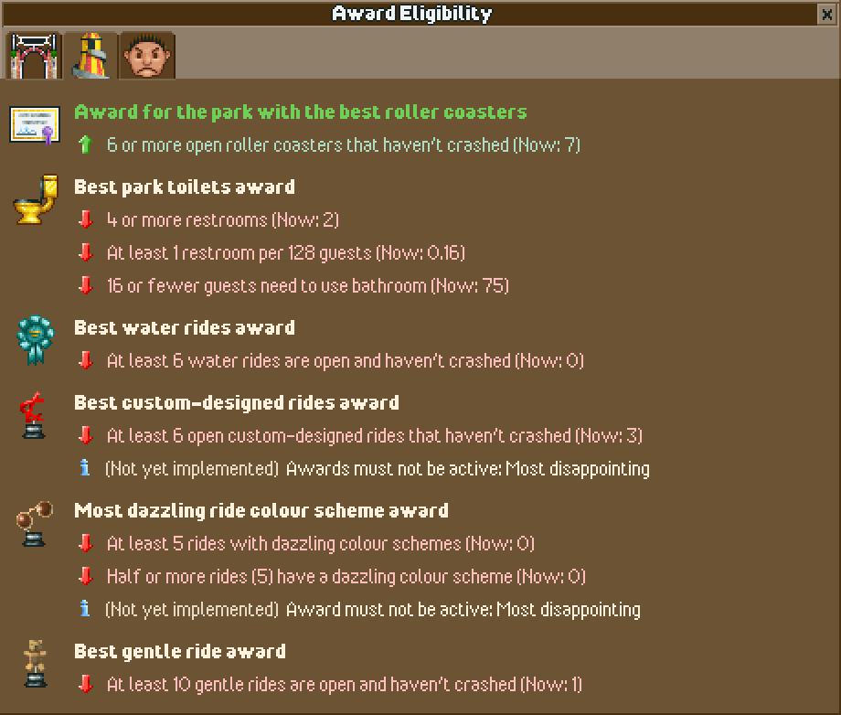

# OpenRCT2 Award Eligibility Plugin

The OpenRCT2 Award Eligibility plugin gives you a detailed breakdown of park awards requirements and if your park meets each one. It also provides the current value to help you reach meet the requirement or stop meeting the requirements for negative awards!

## Features

- Displays a list of park awards across three tabs.
- Highlights the awards you're eligible for.
- Provides detailed requirements for each award, showing which criteria are met and which are not.
- Updates every second when the plugin window is active.

## Current Limitations

- **Incomplete Requirements**: Some award eligibility requirements are not fully implemented as they're either unavailable in the current plugin API or I'm just not clever enough to figure it out yet.
  - **For Most Awards**: It's currently not possible to check which awards are currently active through the plugin API. If and when I'm able to get it added to the API, I'll add new requirements for the affected awards.
  - **Most Disappointing Park Award**: Requirement for "More than half of rides have a satisfaction of 6 or less" is not yet implemented. I don't believe ride satisfaction is available through the plugin API. I'll work on getting it added.
  - **Safest Park Award**: Requirement for "No recent crashes" is not yet implemented. It's possible to see if a ride has ever crashed, but accessing the more complicated recent crashes metric does not appear to be exposed in the plugin API. I'll ask the devs if I just missed or if it can be added.
  - **Best Custom-Designed Rides Award**: Requirement for "At least 6 custom-designed rides" is mostly working, but there's a `hasTrack` flag I don't believe I can access through the plugin API that may or  may not affect the validity of the requirement logic.
- **English-Only**: The plugin currently supports only English. Localization for other languages will be coming when I figure out how to do it.

## References
As a kid, awards in RCT 1 & 2 were an absolute mystery to me. When I saw Marcel Vos's video and Deurklink's guide, it was like solving an ages old mystery. My thanks to them for their work sharing the details for mere mortal and the straight-forward C++ code I referenced constantly.

- [Marcel Vos's How to get all awards in RollerCoaster Tycoon 2](https://www.youtube.com/watch?v=68Rg0znLtx4)
- [Deurklink's Guide: How to win awards with your park in OpenRCT2](https://forums.openrct2.org/topic/2732-guide-how-to-win-awards-with-your-park-in-openrct2)
- [OpenRCT2's Award.cpp](https://github.com/OpenRCT2/OpenRCT2/blob/develop/src/openrct2/management/Award.cpp)

## How to Use

1. Install the plugin by placing the compiled `.js` file into your OpenRCT2 plugin directory.
2. Start OpenRCT2 and load a save or start a new game.
3. Open the plugin from the in-game menu to view the award eligibility window.
4. Review the list of awards and their requirements to see which awards your park is eligible for and what improvements are needed.

## Contributing

Contributions are welcome! If you'd like to help implement missing requirements, add localization support, or improve the plugin in any way, feel free to submit a pull request or open an issue.

## Known Issues

- Some requirements are not yet implemented (see "Current Limitations").
- The plugin does not currently support languages other than English.